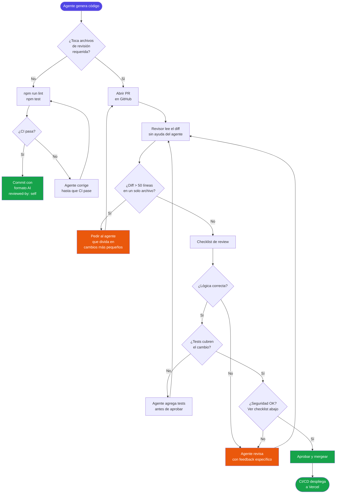

# AI Governance Policy — CineSwipe

**Versión:** 1.0 · **Equipo:** 1-3 personas · **Agentes en uso:** Claude (Anthropic), Google Antigravity

Este documento define cómo usamos agentes de IA en CineSwipe. El objetivo no es
restringir la IA, sino hacer su output predecible, auditable y seguro en un proyecto
en producción real. Tiempo de lectura estimado: **8 minutos**.

> **Contexto importante:** CineSwipe está desplegado en Vercel con CI/CD activo
> (`ci.yml`). Un commit mal revisado puede romper producción en cuestión de minutos.
> Las categorías de abajo reflejan ese riesgo.

---

## Tareas que el agente puede hacer sin aprobación especial

El agente puede generar, modificar y hacer commit de estas tareas directamente,
siempre que el pipeline CI pase (`lint` + `test` + `build`).

| Categoría | Ejemplos concretos en CineSwipe | Por qué es seguro |
|---|---|---|
| **Tests unitarios** | Agregar casos en `useMovies.test.ts`, `useTMDBCache.test.ts`, `useMoviePagination.test.ts` | Los tests no van a producción; el CI los valida |
| **Tipos TypeScript** | Añadir campos a `tmdb.types.ts` (ej. `tagline`, `runtime` de TMDB) | Sin efecto en runtime si los campos son opcionales |
| **Estilos y UI sin lógica** | Cambios de Tailwind en `SwipeCard.tsx` (colores, animaciones, layout) | No afectan estado ni API calls |
| **Corrección de ESLint/TypeScript** | Resolver warnings en cualquier archivo — como los `any` que corregimos en `useMovies.ts:123` | Cambios mecánicos y verificables |
| **Documentación** | Editar `ARCHITECTURE.md`, `DECISIONS.md`, comentarios en `MovieContext.tsx` | Sin impacto en runtime |
| **Constantes de configuración** | Ajustar `MAX_HISTORY = 50` en `MovieContext.tsx`, `PREFETCH_CACHE_TTL` en `main.tsx` | Valores numéricos con efecto acotado y testeable |
| **Scripts de desarrollo** | Agregar scripts en `package.json` (`test:coverage`, `lint:fix`) | No afectan el build de producción |
| **Refactor de funciones puras** | Simplificar `movieHistoryReducer` en `MovieContext.tsx` siempre que los tests pasen | El reducer es puro; los tests existentes verifican el comportamiento |

**Requisito mínimo para commit directo:** `npm run lint && npm test` pasan en local.

---

## Tareas que requieren revisión humana antes de hacer commit

El agente **genera el código**, pero un humano lo revisa y aprueba explícitamente
antes de que llegue a `main`. Ver el [proceso de review](#proceso-de-code-review).

| Categoría | Ejemplos concretos en CineSwipe | Por qué requiere revisión |
|---|---|---|
| **Lógica de fetch y manejo de errores** | Cambios en `useMovies.ts` — `fetchMovies()`, `AbortController`, errores 401/429 | Un bug aquí rompe toda la app para todos los usuarios |
| **Prefetch en `main.tsx`** | Modificar la Promise `window.__cineswipe_prefetch__`, el timing de `hasFreshCache()` | Afecta LCP y la race condition con `useMovies` |
| **Reducer y persistencia de estado** | Modificar `movieHistoryReducer` o la lógica `HYDRATE` / `localStorage` en `MovieContext.tsx` | Un bug en HYDRATE puede corromper el historial de todos los usuarios |
| **Headers de seguridad** | Cualquier cambio a `vercel.json` (CSP, HSTS, cache policies) | Un CSP mal configurado puede bloquear la app o dejar XSS abierto |
| **Dependencias nuevas** | Agregar cualquier paquete a `package.json` | Supply chain risk; aumenta la superficie de ataque |
| **Pipeline CI/CD** | Modificar `.github/workflows/ci.yml` | Un CI roto puede dejar pasar bugs a producción silenciosamente |
| **Tipos del dominio core** | Cambiar `TMDBMovie` o `TMDBDiscoverResponse` en `tmdb.types.ts` | Cambios en tipos base pueden romper type guards (`isTMDBDiscoverResponse`) y la validación de API responses |
| **Configuración de Vite/TS** | `vite.config.ts`, `tsconfig.json` | Pueden afectar tree-shaking, sourcemaps, y el comportamiento del build |
| **`SwipeCard.tsx` — lógica de gestos** | El sistema de Pointer Events, umbrales de swipe, `useRef` de posición | La lógica táctil es el core de UX; los bugs son difíciles de testear en CI |

**Señal de alerta:** Si el agente modifica alguno de estos archivos y el diff supera
50 líneas cambiadas, pedir al agente que lo divida en commits más pequeños antes de revisar.

---

## Tareas que NUNCA deben delegarse al agente

Estas acciones quedan fuera del alcance del agente, independientemente del contexto
o de lo conveniente que parezca en el momento.

| Tarea prohibida | Por qué | Alternativa |
|---|---|---|
| **Rotar o generar el `VITE_TMDB_KEY`** | El agente no debe tener acceso a credenciales reales; una key generada por IA podría ser cacheada en logs del agente | Hacerlo manualmente en TMDB Dashboard → Vercel Settings (ver `SECURITY.md`) |
| **Forzar push a `main`** (`git push --force`) | Puede borrar commits de producción e invalidar el historial del CI | Abrir un PR y mergear normalmente |
| **Modificar `.gitignore` para incluir `.env`** | Podría exponer el token de TMDB en el repositorio público | Revisar siempre `.gitignore` manualmente antes de cualquier commit que lo toque |
| **Tomar decisiones sobre qué datos recopilar del usuario** | Son decisiones de privacidad con implicaciones legales (GDPR, CCPA) | Decidir entre el equipo y documentar en `SECURITY.md` → User Data Inventory |
| **Firmar hallazgos de seguridad como "aceptados"** | El agente puede subestimar el impacto real de una vulnerabilidad | Solo el equipo puede marcar riesgos como aceptados en `SECURITY.md` |
| **Ejecutar `npm audit fix --force`** en `main` | Puede introducir breaking changes (ej. Vite 8) sin pruebas adecuadas | Hacer en rama separada, verificar build, luego PR |
| **Configurar o modificar variables de entorno en Vercel Dashboard** | El agente no tiene acceso directo y no debería tenerlo | Hacerlo manualmente en el dashboard |

---

## Formato de commit para código generado por IA

### Motivación

El historial actual de CineSwipe tiene commits como `"deploy vercel 3"` o
`"git action 2"`. Eso no indica qué cambió ni si fue generado por IA. Este
formato garantiza trazabilidad sin ralentizar el flujo de trabajo.

### Formato requerido

```
<tipo>(<scope>): <descripción breve en imperativo>

[cuerpo opcional — qué y por qué, no cómo]

ai: <nombre-agente>
prompt: "<resumen de 1 línea del prompt que generó el código>"
reviewed-by: <@handle o "self">
```

### Tipos válidos

| Tipo | Cuándo usarlo |
|---|---|
| `feat` | Nueva funcionalidad (ej. filtro por año en `useMovies.ts`) |
| `fix` | Corrección de bug (ej. `AbortError` no propagado) |
| `test` | Solo tests, sin cambio de lógica |
| `style` | Tailwind, CSS, formato — sin cambio de lógica |
| `refactor` | Restructuración sin cambio de comportamiento |
| `chore` | Dependencias, CI, configuración |
| `docs` | Documentación únicamente |
| `security` | Headers, CSP, rotación de keys |

### Ejemplos concretos de CineSwipe

```bash
# ✅ Correcto — feat generado por Claude
feat(useMovies): add exponential backoff for TMDB 429 responses

Adds retry logic with 3 attempts and 1s/2s/4s delays.
Prevents cascade failures during TMDB rate limit windows.

ai: claude-sonnet-4-6
prompt: "add retry with exponential backoff to fetchMovies for 429 errors"
reviewed-by: @mldesojose1
```

```bash
# ✅ Correcto — test generado por agente, sin revisión requerida
test(useTMDBCache): add TTL boundary cases for 5-min expiry

ai: claude-sonnet-4-6
prompt: "add edge case tests for TTL exactly at 300000ms boundary"
reviewed-by: self
```

```bash
# ✅ Correcto — seguridad, requirió revisión
security(vercel): add HSTS and tighten CSP script-src

Removes unsafe-inline from script-src after confirming
production build generates no inline scripts.

ai: claude-sonnet-4-6
prompt: "remove unsafe-inline from CSP vercel.json and verify production build"
reviewed-by: @mldesojose1
```

```bash
# ❌ Incorrecto — no dice nada útil
git action 4

# ❌ Incorrecto — no indica si fue revisado
fix: update useMovies

# ❌ Incorrecto — el agente no firma commits de credenciales
chore: rotate TMDB API key
```

---

## Proceso de Code Review

### Diagrama de flujo



### Checklist de revisión para código generado por IA

Usar esta checklist al revisar cualquier PR de código generado. Tarda ~3 minutos.

**Correctitud**
- [ ] El comportamiento coincide con lo descrito en el prompt (no solo con lo que el diff muestra)
- [ ] Los casos de error están manejados (en `useMovies.ts`: 401, 404, 429, AbortError, red caída)
- [ ] No hay efectos secundarios no intencionados en componentes no relacionados

**Tests**
- [ ] Existe al menos 1 test por cada rama lógica nueva
- [ ] Los mocks no enmascaran el comportamiento real (revisar si `vi.mock('../useTMDBCache')` está bien configurado)
- [ ] `npm test` pasa localmente antes de aprobar

**Seguridad** *(solo si el PR toca archivos de revisión requerida)*
- [ ] No hay tokens, claves o passwords hardcodeados
- [ ] Los datos de usuario (`localStorage`, `sessionStorage`) siguen el inventario de `SECURITY.md`
- [ ] Si se modificó `vercel.json`: los headers de seguridad siguen presentes en el diff

**Calidad específica de CineSwipe**
- [ ] Si tocó `MovieContext.tsx`: el reducer sigue siendo una función pura (sin side effects)
- [ ] Si tocó `useMovies.ts`: el `AbortController` limpia correctamente en el cleanup del `useEffect`
- [ ] Si tocó `main.tsx`: `window.__cineswipe_prefetch__` se resuelve a `null` en todos los caminos (`.finally()`)
- [ ] Si tocó `SwipeCard.tsx`: los Pointer Events tienen `releasePointerCapture` en el cleanup

**Formato**
- [ ] El commit message sigue el formato `ai:` / `prompt:` / `reviewed-by:`
- [ ] El scope del commit es preciso (no usar `chore: misc fixes`)

---

## Cómo incorporar a un nuevo miembro al equipo

Si alguien se une al proyecto y necesita entender las reglas de IA en < 10 minutos:

1. **Leer este documento** completo (8 min)
2. **Revisar un PR de ejemplo** — buscar commits con tag `ai:` en el historial de GitHub
3. **Primera semana:** Todos los commits generados por IA requieren revisión del miembro existente, independientemente de la categoría
4. **A partir de la segunda semana:** Autonomía completa sobre las tareas de la columna "sin aprobación especial"

### Preguntas frecuentes de onboarding

**¿Puedo pedirle al agente que escriba todo `SwipeCard.tsx` de cero?**
Sí — es código de UI sin lógica de negocio crítica. Requiere revisión antes de commit por estar en la lista de revisión requerida (lógica de gestos), pero el agente puede generar el draft completo.

**¿Puedo pedirle al agente que cambie la key de TMDB?**
No. Ver sección "Tareas que NUNCA deben delegarse". El proceso está en `SECURITY.md`.

**¿Qué hago si el agente genera código que parece correcto pero no entiendo del todo?**
No lo apruebas hasta entenderlo. El agente puede explicar cada línea. Un PR aprobado sin entender es un riesgo que asumes tú, no el agente.

**¿El agente puede revisar el código de otro agente?**
Puede ayudar a identificar problemas, pero la aprobación final es siempre humana. No sustituyas un `reviewed-by: @handle` con `reviewed-by: claude`.

---

## Referencias

- [`SECURITY.md`](./SECURITY.md) — inventario de datos, rotación de keys, checklist de deploy
- [`DECISIONS.md`](./DECISIONS.md) — ADR-004: metodología de desarrollo con IA
- [`ARCHITECTURE.md`](./ARCHITECTURE.md) — decisiones de diseño del proyecto
- [`.github/workflows/ci.yml`](./.github/workflows/ci.yml) — pipeline de lint + test + build
- [Conventional Commits](https://www.conventionalcommits.org/) — estándar de formato de commits
